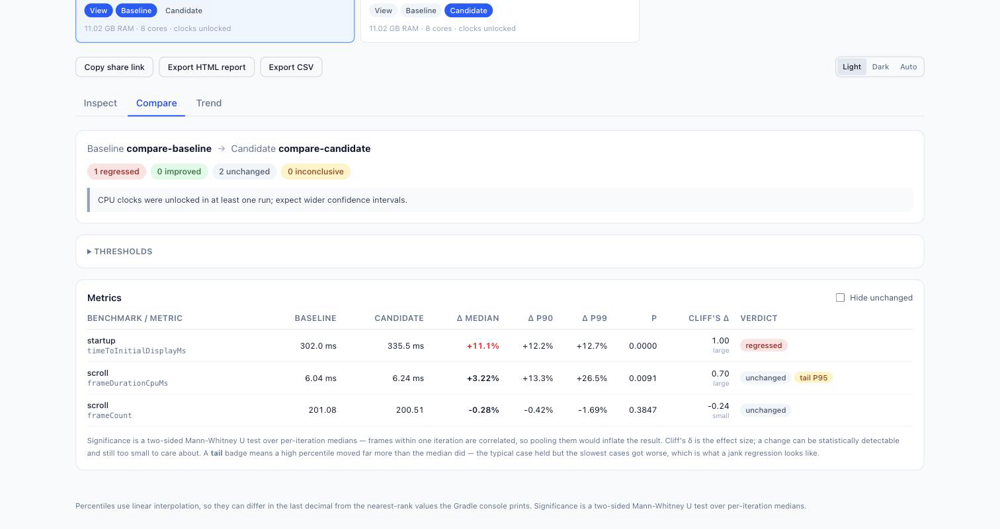

# Android Macrobenchmark Viewer

Inspect, compare and trend [Android Macrobenchmark](https://developer.android.com/topic/performance/benchmarking/macrobenchmark-overview)
results in your browser.

Drop in a `benchmarkData.json` and get every benchmark and every metric with real
percentiles. Drop in two and get a statistically-tested regression report that
tells you whether your change actually made things slower — or whether the
device was just noisy.

**Nothing is uploaded.** Parsing, statistics and rendering all happen in the
page. There is no server, no telemetry, and no network request after the app
loads.

[**Try it →**](https://androidmacrobenchmarkviewer.onrender.com)



## What it does

### Inspect

Every benchmark, every metric — measured *and* sampled. `frameDurationCpuMs`
and `frameOverrunMs` get the same treatment as `timeToInitialDisplayMs`:

- min / median / mean / max, **P90 / P95 / P99**, standard deviation
- **between-iteration CV** — how reproducible the run actually is
- a box plot per iteration, so a single thermal outlier is visible
- a per-iteration line, so warmup drift is visible
- the fields the Gradle console buries: warmup and repeat iterations, thermal
  throttle sleep, total run time, parameterized variants

It also tells you when a run is not worth trusting — unlocked CPU clocks,
thermal throttling, high variance, or a single iteration.

### Compare

Pick a baseline and a candidate. For every metric you get the median delta, the
delta at each tail percentile, and a verdict:

| Verdict | Meaning |
|---|---|
| **regressed** / **improved** | Change exceeds your threshold *and* is statistically distinguishable from noise |
| **unchanged** | Within the threshold |
| **inconclusive** | Too few iterations, or the baseline is not reproducible enough to judge |

Two details make this more than a percentage diff:

- **Significance is a two-sided Mann-Whitney U test over per-iteration medians.**
  Frames within one iteration are correlated, so pooling two thousand raw frame
  samples would return p ≈ 0 for a change of no practical size. Collapsing to
  one value per iteration keeps *n* honest. Cliff's δ reports the effect size
  alongside it, because a detectable change can still be too small to care about.
- **A `tail` badge flags a percentile that moved far more than the median.**
  A jank regression often barely shifts the median of a frame-timing metric
  while P95 doubles. Without this the row reads "unchanged" and you move on.

Thresholds (minimum change, α, maximum baseline CV, minimum iterations) are
adjustable and persist locally. Comparing across different devices or Android
versions produces a loud warning, because those deltas measure the hardware.

### Trend

Drop in several runs — or a whole folder — and see each metric across them, with
a P90 band and a flakiness flag for metrics that are never reproducible.
`benchmarkData.json` has no timestamp, so ordering comes from file modification
time; run labels are editable.

### Share and export

- **Copy share link** — the data is gzipped into the URL *fragment*, which
  browsers never send to a server. Scoped to what you are viewing so it fits.
- **Export HTML report** — one self-contained file, no scripts, no network.
  Attach it to a PR or open it offline.
- **Export CSV** — for the spreadsheet.

## Where to find your benchmarkData.json

After a Macrobenchmark run, Gradle writes it under:

```
<module>/build/outputs/connected_android_test_additional_output/<variant>/<device>/
```

Look for `<package>-benchmarkData.json`. If it isn't there, make sure
`androidx.benchmark.output.enable` is not disabled.

No file handy? Click **Load sample data** in the app.

## Run it locally

```bash
git clone https://github.com/sudhi001/AndroidMacroBenchmarkViewer.git
cd AndroidMacroBenchmarkViewer
npm install
npm run dev
```

Then open http://localhost:5173.

| Command | What it does |
|---|---|
| `npm run dev` | Dev server with hot reload |
| `npm run build` | Production build into `dist/` |
| `npm run preview` | Serve the production build |
| `npm test` | Run the test suite |
| `npm run typecheck` | TypeScript, no emit |

## How it is put together

```
src/core/     Pure TypeScript. No DOM, no React. Fully unit-tested.
  parse.ts      benchmarkData.json -> normalized model (tolerant, never schema-locked)
  stats.ts      percentiles, CV, Mann-Whitney U, Cliff's delta
  compare.ts    baseline vs candidate -> verdicts
  trend.ts      N runs -> per-metric series
  share.ts      gzip + base64url for the URL fragment
  export/       CSV and self-contained HTML
src/web/      React UI
public/fixtures/  Sample data, also used by the tests
```

The parser never hardcodes a metric name — it iterates whatever the file
contains — so new AGP metrics work without a change here. Unknown fields and
missing sections degrade into a visible warning rather than a blank page.

## Notes on the numbers

- **Percentiles use linear interpolation** (the NumPy/R "type 7" definition).
  `androidx.benchmark` picks a nearest rank instead, so values can differ in the
  last decimal from what the Gradle console prints. When a file already contains
  `P50`/`P90`/`P95`/`P99`, those reported values are used as-is.
- **"CV" in the metric table is between-iteration**, not the spread of all
  pooled samples. For frame timing the pooled spread is ~50% purely because
  frames legitimately differ; that says nothing about whether a second run would
  reproduce the result.

## Not included

There is no CLI or GitHub Action, so this cannot fail a PR on regression on its
own — export the HTML report and attach it instead. `src/core/` has no DOM
dependencies specifically so a CLI can be added later without a rewrite;
contributions welcome.

## Contributing

Issues and pull requests are welcome. `npm test` and `npm run typecheck` must
pass; CI runs both on every PR. Real-world `benchmarkData.json` files from AGP
versions not yet covered by `public/fixtures/` are especially useful.

## License

[MIT](LICENSE)
